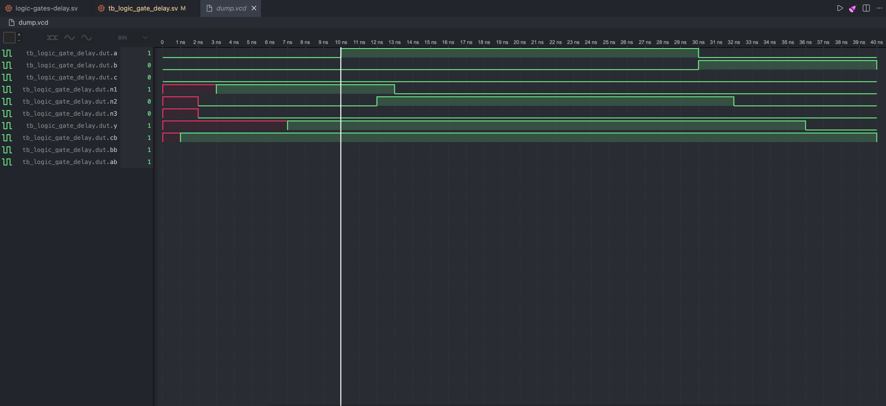

# Architectural Log: Propagation Delay & Critical Paths

In this log, I analyze how physical gate delays compunds across a circuit layout using a 3-input combinational logic equation.

## The Theory

Digital logic doesn't compute instantly; transistors require physical time to switch state based on their capacitance. Using directives like ``timescale 1ns/1ps `, we can model sequential delays down to the picosecond:

```
systemverilog
// Parallel inversion layer introducing a 1ns gate delay
assign #1 {ab, bb, cb} = ~{a, b, c};
```

Using **destructuring assignments** on the left side of the block allows us to immediately shatter multi-bit buses into explicitly named, readable signal tracks, mimicking the physical separation of wires across a microchip layout.

## Simulation & Waveform Analysis

When running the simulation, I observed the incredible way of how the simulator handles unknown states('x')

Simulation tool used: EDA Playground & Wavetrace(VScode Ext).



## Key Observations

1. **Lazy Evaluation of `0`:** Gates `n2` and `n3` resolved to a stable `0` after exactly 2ns. Because an AND gate evaluates to `0` the moment _any_ of its inputs are definitively `0`, the simulator short-circuited early without waiting for the slow inverters.
2. **The Inverter Bottleneck:** Gate `n1` stayed at `x` (unknown) until 3ns. Because it was transitioning to a `1`, it couldn't guess; it had to wait a full 1ns for the inverter layer to settle before starting its own 2ns gate delay countdown.
