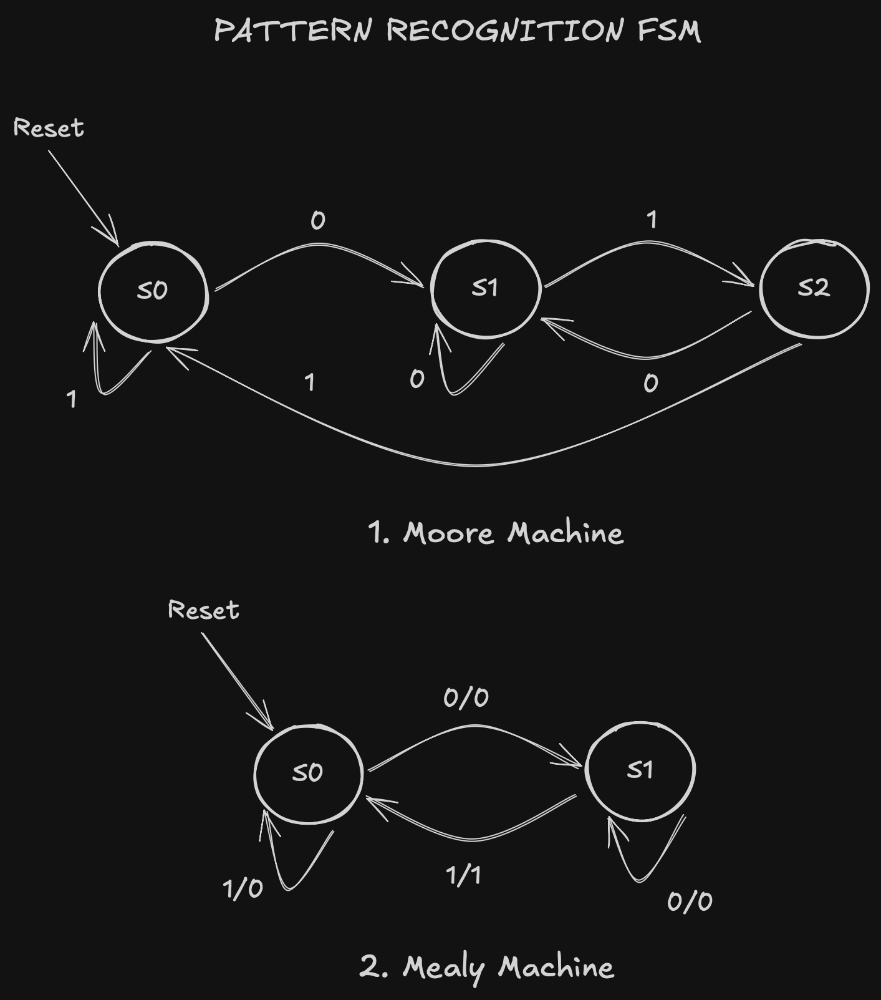
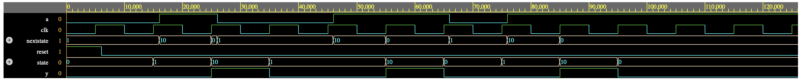

## Design Specification: Pattern Sequence Detector

**Objective:**
Design and compare Moore and Mealy Finite State Machines (FSMs) that continuously scan a serial input stream ($A$) on every clock cycle. The circuit must assert the output ($Y = 1$) whenever the last two received bits match the sequence `01`.

### System Requirements:

- **Input (A):** 1-bit serial data stream sampled on `posedge clk`.
- **Output (Y):** 1-bit signal asserting `TRUE` (`1`) when the target pattern `01` is recognized.
- **Architecture:** Implement both **Moore** (output dependent only on state) and **Mealy** (output dependent on state and current input) topologies.
- **Verification Vector:** Verify both designs against the sequence: `0100110111...`

### State transition diagram



### System Verilog implementation

```
//Moore machine
module patterndetectormoore(input logic clk,
                         input logic reset,
                         input logic a,
                         output logic y);
    typedef enum logic[1:0] {S0, S1, S2} statetype;
    statetype state, nextstate;

    //State register
    always_ff @(posedge clk, posedge reset)
      if (reset) state <= S0;
      else state <= nextstate;

    //Next state logic
    always_comb
      case (state)
        S0: if (a) nextstate = S0;
            else   nextstate = S1;
        S1: if (a) nextstate = S2;
            else   nextstate = S1;
        S2: if (a) nextstate = S0;
            else   nextstate = S1;

        default:   nextstate = S0;
      endcase

    //Output logic
    assign y = state == S2;
endmodule


//Mealy machine
module patterndetectormealy(input logic clk,
                            input logic reset,
                            input logic a,
                            output logic y);
    typedef enum logic {S0, S1} statetype;
    statetype state, nextstate;

    always_ff @(posedge clk, posedge reset)
      if (reset) state <= S0;
      else state <= nextstate:

    //Next state logic
    always_comb
      case(state)
        S0: if (a) nextstate = S0;
            else   nextstate = S1;
        S1: if (a) nextstate = S0;
            else   nextstate = S1;
        default:   nextstate = S0;
      endcase

    //Output logic
    assign y = (a & state == S1);
endmodule

```

### Simulation


