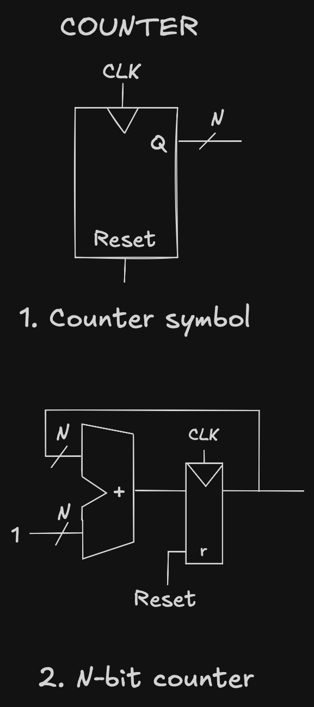
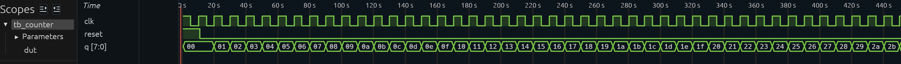

### The Binary Counter Loop: Demystifying the Hardware

An N-bit binary counter looks like a complex state machine from the outside, but under the hood, it's a massive architectural shortcut. It doesn't use any specialized tracking logic—it's just a combinational adder and a sequential register locked in a feedback loop.

### How It Works:

- The State Holder: The Register stores the current count value (Q).
- The Look-Ahead: The Combinational Adder constantly reads Q, adds 1 to it, and presents the new value (Q+1) right to the register’s input doors.
- The Snapshot: On the rising edge of the clock, the register slams its doors shut, captures that Q+1 value, updates its output, and the cycle repeats.

### Example waveform

